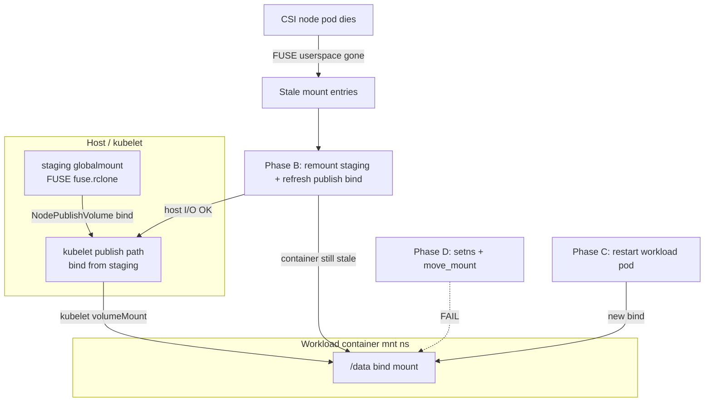

# Mount Recovery — Cluster Findings (Issue #58)

**Date:** 2026-07-12  
**Cluster:** `informaten` (k3s, node `debian-01`)  
**Branch:** `feat/nodestagevolume-staging`  
**Latest commit tested:** `c985d78` (`fix(container-remount): clear CLOEXEC before os.NewFile`)

## Executive summary

| Goal | Result | Production path |
|------|--------|-----------------|
| Recover kubelet/staging FUSE after CSI node restart | **Works** (Phase B) | Enable `node.staging.enabled` + `node.remount.enabled` |
| Recover workload container I/O **without pod restart** | **Does not work** (Phase D blocked) | Volume recovery operator or manual pod rollout |
| Recover workload I/O **with pod restart** | **Works** | Operator (Phase C) or `kubectl rollout restart` |

**Bottom line:** Zero-downtime application I/O after CSI driver death is **not achievable** with the current Phase D implementation on this cluster. Host-side recovery is solid; container mount namespaces remain stale until pods are recreated.

---

## Architecture under test



**Phases implemented:**

| Phase | Feature | Status |
|-------|---------|--------|
| A | Stale FUSE detection, idempotent `NodePublishVolume` | Implemented, unit-tested |
| B | `NodeStageVolume` staging + persisted `--remount` on boot | **Validated on cluster** |
| C | Volume recovery operator (pod restart) | Implemented; not exercised in this retest |
| D | Container mount-namespace remount (`hostPID` + `setns`) | **Implemented; fails on cluster** |

---

## Test environment

### Images

| Run | Image | Git |
|-----|-------|-----|
| TC-08 retest #1 | `ttl.sh/csi-rclone-tc08-retest-20260712145952:8h` | `9b4fc0f` |
| TC-08 retest #2 | `ttl.sh/csi-rclone-tc08-retest2-20260712150330:8h` | `c985d78` |

### Helm values

```bash
helm upgrade --install csi-rclone-e2e ./charts -n csi-rclone-e2e \
  -f hack/e2e/helm-values.yaml \
  -f hack/e2e/helm-values-staging.yaml
```

- `node.staging.enabled: true`
- `node.remount.enabled: true`
- `node.hostPID: true` (615 entries under `/proc` in CSI pod — gate satisfied)

### Workloads

- `e2e-writer` — no `mountPropagation`
- `e2e-writer-propagated` — `mountPropagation: HostToContainer`

Both use PVCs backed by MinIO via `rclone-e2e` StorageClass.

---

## TC-08: CSI restart without workload restart

**Procedure:** Establish live I/O baseline → record workload pod UIDs → force-delete CSI node pod only → verify container and host I/O with unchanged workload UIDs.

### Run #1 (`9b4fc0f`)

| Check | Result | Evidence |
|-------|--------|----------|
| Stack deployed | PASS | All pods Running; `hostPID=true` |
| Baseline container I/O | PASS | `fuse.rclone` on `/data`; sentinels `W-20260712T130159Z`, `P-20260712T130200Z` |
| CSI node force-delete | PASS | `csi-rclone-node-656t4` → `csi-rclone-node-pkzsg` |
| Workload UIDs unchanged | PASS | `19ce1b79-…` / `49bc7e91-…` before and after |
| Phase B staging remount | PASS | `Remounting 6 persisted mount states`, `Successfully remounted volume` |
| Publish bind refresh | PASS | `Refreshed publish bind` for both writer publish paths |
| Phase D container remount | **FAIL** | `clear CLOEXEC on tree fd: bad file descriptor` (both writers) |
| Post-restart container I/O | **FAIL** | `Transport endpoint is not connected` on `tail`, `echo`, `cat` |
| Post-restart host publish write | **PASS** | `echo HOST-W-130252 > .../host-test.txt` succeeded via SSH on kubelet publish path |
| Post-restart host sentinel read | STALE | Still showed baseline `P-20260712T130200Z` (container namespace diverged from refreshed host bind) |

**CSI log excerpt (container remount failure):**

```
I0712 13:02:15.335477 container_remount_linux.go:196] nsenter move_mount failed for pid 758738 mount /data, trying setns helper: clear CLOEXEC on tree fd: bad file descriptor
W0712 13:02:15.336183 container_remount.go:170] Container remount failed for pod 49bc7e91-… mount /data: clear CLOEXEC on tree fd: bad file descriptor
```

### Run #2 (`c985d78` — CLOEXEC fix attempt)

Applied fix: call `clearCloseOnExec(treeFD)` **before** `os.NewFile()` instead of `treeFile.Fd()` after wrap.

| Check | Result | Evidence |
|-------|--------|----------|
| Image deployed | PASS | `ttl.sh/csi-rclone-tc08-retest2-20260712150330:8h` |
| Baseline container I/O | PASS | `B2-W-130606`, `B2-P-130607` |
| CSI node force-delete | PASS | Workload UIDs unchanged |
| Phase D container remount | **FAIL** | Same `clear CLOEXEC on tree fd: bad file descriptor` |
| Post-restart container I/O | **FAIL** | `Transport endpoint is not connected` |
| Post-restart host publish read | PARTIAL | Both paths showed `B2-P-130607` (propagated sentinel on host; writer host path did not reflect `B2-W`) |

**Conclusion:** TC-08 **FAIL** on both runs. Phase D is blocked before `nsenter` or `setns` can complete mount repair.

---

## Pod restart recovery (control test)

After TC-08 failure:

```bash
kubectl -n csi-rclone-e2e rollout restart deploy/e2e-writer deploy/e2e-writer-propagated
```

| Check | Result |
|-------|--------|
| Container I/O after restart | **PASS** |
| New writes | `RECOVER-W-130315`, `RECOVER-P-130316` |
| FUSE mount healthy | `minio:e2e-bucket on /data type fuse.rclone` |

This confirms the **operator / rollout restart** path is the reliable recovery mechanism.

---

## Root-cause analysis

### Why Phase B alone is insufficient

1. CSI node pod death kills in-process FUSE userspace.
2. Phase B remounts FUSE at the **staging** path and refreshes the **kubelet publish** bind.
3. Workload containers hold a **separate bind mount** in their own mount namespace, created at pod start.
4. That container-side bind still references the **dead FUSE mount object** → `ENOTCONN`.

Evidence: host kubelet publish path accepted writes (`HOST-W-130252`) while `kubectl exec` into the same pod failed with `ENOTCONN`.

### Why Phase D fails on this cluster

Attempted repair sequence per publish path:

1. `open_tree(OPEN_TREE_CLONE)` on recovered staging path
2. Clear `FD_CLOEXEC` on tree fd for inheritance via `exec.Cmd.ExtraFiles`
3. Primary: `nsenter -F -t <pid> -m -- /bin/sh -c 'mount --move /proc/self/fd/3 <mountPoint>'`
4. Fallback: `__container-remount` helper subprocess with `setns(CLONE_NEWNS)` + `move_mount`

**Observed failure:** Step 2 returns `bad file descriptor` on the `open_tree` fd inside the CSI container (static binary, `CGO_ENABLED=0`). Both primary and fallback paths abort before mount namespace repair.

**Historical failures (prior commits on same cluster):**

| Approach | Error |
|----------|-------|
| `nsenter` exec helper at `/rcloneplugin` | `No such file or directory` in workload mnt ns |
| `nsenter` exec via `/proc/1/root/.../remount-helper` | Same |
| `setns` from Go subprocess (v7) | `invalid argument` |
| `treeFile.Fd()` for CLOEXEC (898e23e) | `bad file descriptor` |
| `treeFD` before `NewFile` (c985d78) | `bad file descriptor` (unchanged) |

### mountPropagation

`e2e-writer-propagated` uses `HostToContainer`. **Neither writer recovered** without pod restart. `mountPropagation` alone does not fix stale FUSE after CSI restart on this cluster.

---

## What works in production

### Recommended configuration

```yaml
node:
  staging:
    enabled: true
  remount:
    enabled: true
  hostPID: true   # required for Phase D if pursued; harmless when using operator fallback
```

Plus deploy the volume recovery operator:

```bash
kubectl apply -k deploy/volume-recovery-operator/
```

### Recovery behaviour

| Event | Automatic recovery | User impact |
|-------|-------------------|-------------|
| CSI node pod restart / OOM | Staging FUSE + kubelet paths restored | Workload pods need restart (operator handles) |
| New pod scheduled | Full stage+publish via kubelet | None |
| Kubelet re-calls `NodePublishVolume` on stale publish path | Phase A self-healing | None if pod recreated |

### Docker build

Multi-arch builds use `$BUILDPLATFORM` for the Go builder (native compile) and `$TARGETPLATFORM` for the runtime image — avoids per-arch QEMU during compilation.

---

## Open issues / next steps

1. **Phase D `open_tree` fd inheritance** — investigate why `fcntl(F_GETFD)` fails on `open_tree` fds in the CSI container; consider `unix.Dup3` + pipe-based fd passing, or a minimal static helper baked into workload-visible hostPath.
2. **TC-09 hostPID gate** — not re-run; `hostPID=true` confirmed (615 `/proc` entries). A `hostPID=false` negative test remains undocumented.
3. **Automate TC-08** — script in `hack/e2e/` with exit codes for CI.
4. **Operator integration test** — deploy operator in e2e namespace and assert pod restart after CSI node delete without manual rollout.

---

## Cleanup

E2e stack removed after testing:

```bash
./hack/e2e/cleanup.sh
```

---

## References

- [SeaweedFS #212](https://github.com/seaweedfs/seaweedfs-csi-driver/pull/212) — staging + publish bind architecture
- [SeaweedFS #255](https://github.com/seaweedfs/seaweedfs-csi-driver/pull/255) — container mount namespace remount
- [JuiceFS mount propagation](https://juicefs.com/docs/csi/guide/configurations/#automatic-mount-point-recovery)
- Internal: `docs/integration-test-plan.md`, `docs/mount-recovery.md`
